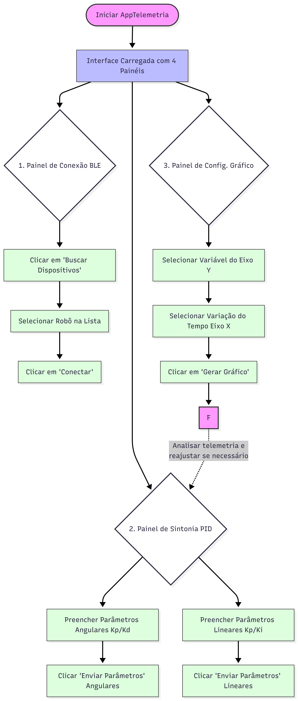

# Interface de Telemetria e Sintonia Dinâmica via BLE para um Robô Seguidor de Linha Autônomo

Este programa é uma ferramenta de auxílio para a configuração e visualização de parâmetros de um robô seguidor de linha que visa desenvolver uma aplicação desktop para estabelecer uma comunicação Bluetooth Low Energy (BLE) bidirecional com um robô seguidor de linha, permitindo o envio de comandos de controle e a visualização gráfica de dados telemétricos.

## 1\. Descrição do Projeto

### Motivação

No desenvolvimento de robôs seguidores de linha para competições, a etapa de sintonia de parâmetros de controle (como as constantes do controlador PID) é frequentemente um processo iterativo, demorado e cego. Atualmente, a alteração de parâmetros costuma ser feita recompilando o código do microcontrolador, o que é ineficiente no ambiente dinâmico de testes em pista. Além disso, a análise do
comportamento dinâmico do robô (leitura de erro dos sensores e velocidade dos motores ao longo do tempo) carece de ferramentas de visualização gráfica que permitam um diagnóstico rápido e preciso. O problema a ser resolvido é a ausência de uma ferramenta centralizada e de fácil usabilidade que permita a comunicação bidirecional com o microcontrolador (ESP32) para ajuste de variáveis de controle em tempo real e análise gráfica da telemetria, economizando tempo e facilitando o aprendizado de futuros responsáveis pelo robô.

### Objetivo

Desenvolver uma aplicação desktop para estabelecer uma comunicação Bluetooth Low Energy (BLE) bidirecional com um robô seguidor de linha, permitindo o envio de comandos de controle e a visualização gráfica de dados telemétricos.

  * Modelar e implementar classes em Python para abstrair a conexão BLE, a recepção de pacotes assíncronos e o tratamento de erros.
  * Desenvolver uma Interface Gráfica de Usuário (GUI) robusta, dividida em painéis (Sintonia de PID e Gráficos de Telemetria).
  * Implementar rotinas de conversão de dados das strings formatadas enviadas pelo ESP32 para estruturas de dados em Python.
  * Plotar gráficos bidimensionais utilizando os dados recebidos dos sensores frontais e dos encoders das rodas.

## 2\. Guia de Uso

### Instalação

Para executar o programa, você precisará do Python 3 e das bibliotecas listadas no arquivo `requirements.txt`. O processo recomendado é:

1.  **Clone o repositório:**

    ```bash
    git clone <url-deste-repositorio>
    cd interface_telemetria
    ```

2.  **Crie um ambiente virtual (recomendado):**

    ```bash
    python -m venv venv
    source venv/bin/activate  # No Windows: venv\Scripts\activate
    ```

3.  **Instale as dependências:**

    ```bash
    pip install -r requirements.txt
    ```

### Fluxo de Uso

O programa foi projetado para ser intuitivo. Siga os passos abaixo para utilizar o programa.



**1. Estabelecer Conexão (Painel Superior Esquerdo)**
* Verifique o status atual da conexão (Padrão: "Desconectado").
* Clique no botão **Buscar Dispositivos** para escanear a área.
* Selecione o endereço/nome do robô na lista suspensa.
* Clique no botão **Conectar** para iniciar a comunicação bidirecional.

**2. Envio de Parâmetros de Controle (Painel Superior Direito)**
* **Sintonia Angular:** Insira os valores nas caixas de texto correspondentes (Kp e Kd) e clique em **Enviar Parâmetros**.
* **Sintonia Linear:** Insira os valores nas caixas de texto correspondentes (Kp e Ki) e clique em **Enviar Parâmetros**.
* Os comandos são enviados instantaneamente ao ESP32 via BLE.

**3. Configuração da Telemetria (Painel Inferior Direito)**
* Utilize este painel para montar a visualização de dados.
* Selecione qual dado será monitorado no Eixo Y (ex: leitura de erro dos sensores ou encoders).
* Selecione a janela de variação de tempo para o Eixo X.
* Clique em **Gerar Gráfico**.

**4. Visualização em Tempo Real (Painel Inferior Esquerdo)**
* Monitore o gráfico de telemetria atualizado dinamicamente.
* Analise o comportamento do robô com os parâmetros atuais.
* Retorne à etapa 2 para reajustar o PID iterativamente até atingir a sintonia ideal.
